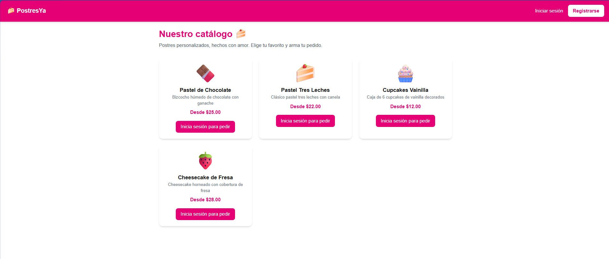
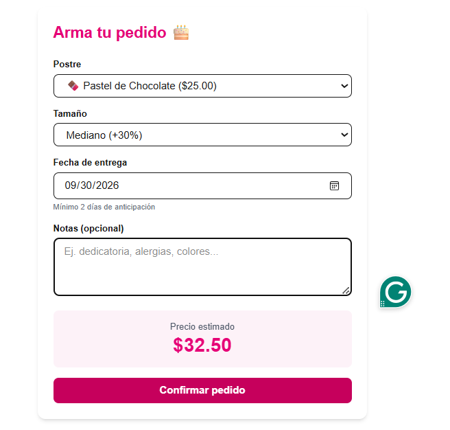
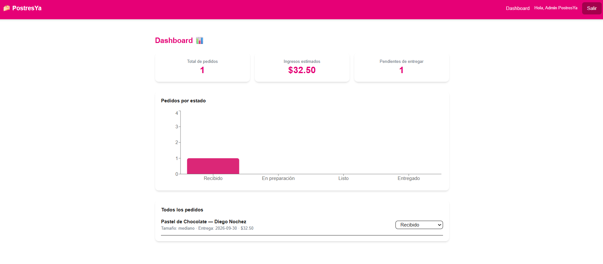

# PostresYa 🍰

Plataforma web para pedidos personalizados de repostería, inspirada en ISA CAKE SV.

**Enlace de despliegue:** https://postresya-web.vercel.app

## Descripción

PostresYa permite a los clientes explorar un catálogo de postres, armar pedidos personalizados (tamaño y fecha de entrega) con precio calculado dinámicamente, y dar seguimiento al estado de sus pedidos. La administradora gestiona todos los pedidos desde un dashboard con estadísticas y gráfica.

## Tecnologías

- **Frontend:** React + Next.js (App Router), Tailwind CSS
- **Manejo de estado:** Context API (autenticación de usuario)
- **Backend:** API REST propia con Route Handlers de Next.js
- **Gráficas:** Recharts
- **Despliegue:** Vercel

## Arquitectura (capas)

- **Capa de datos** (`src/app/lib/data.js`): datos semilla (productos, usuarios, pedidos).
- **Capa de lógica** (`src/app/api/**`): rutas API REST que validan datos, calculan precios y aplican reglas de negocio.
- **Capa de UI** (`src/app/**/page.js`, `components/`): páginas y componentes React que consumen la API mediante Axios.

## Roles y permisos

| Rol | Permisos |
|---|---|
| Cliente | Ver catálogo, registrarse/iniciar sesión, hacer pedidos, ver sus propios pedidos |
| Admin | Ver dashboard con estadísticas, ver todos los pedidos, cambiar el estado de cualquier pedido |

**Cuenta de administrador para pruebas:**
- Correo: `admin@postresya.com`
- Contraseña: `admin123`

## Funcionalidades implementadas

- [x] Autenticación con login y registro (Context API + localStorage)
- [x] Rutas protegidas según rol (cliente / admin)
- [x] API REST propia con validaciones (fecha mínima de entrega, campos obligatorios)
- [x] Cálculo dinámico de precios según tamaño del producto
- [x] Actualización dinámica de datos (auto-refresh cada 5 segundos)
- [x] Dashboard con gráfica de pedidos por estado (Recharts)
- [x] Diseño responsive con Tailwind CSS

## Cómo correr el proyecto localmente

```bash
npm install
npm run dev
```

Luego abre `http://localhost:3000` en tu navegador.

## Capturas de pantalla

### Catálogo de productos


### Formulario de pedido


### Mis pedidos (cliente)

### Dashboard (admin)


Revision de documento y pruebas de proyecto - Alexander Rosales

## Equipo

- Mariana Flores
- Alexander Rosales
